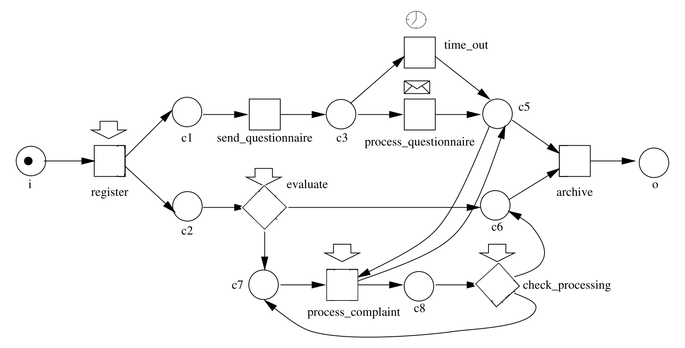
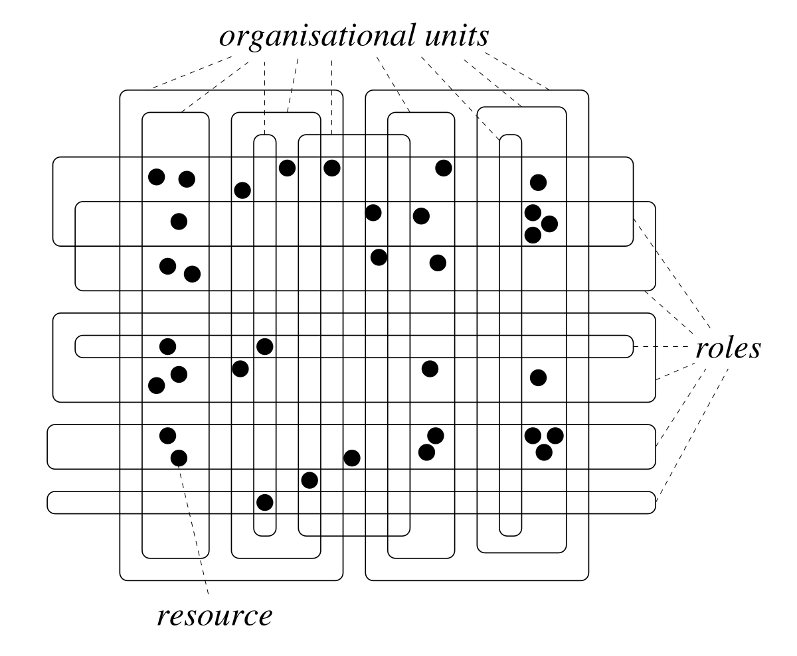

------

# 引子

[Petri 网](https://en.wikipedia.org/wiki/Petri_net)。

------

# 说明

这个幻灯片的主要内容翻译自论文：

- [The Application of Petri Nets to Workflow Management, Wil van der Aalst, 1998](../references/petri-net/the-application-of-petri-nets-to-workflow-management.pdf).

为了适用于工厂的语境，我对下面两个术语做了调整：

- Case 改为 Order（订单）。
- Work Item 改为 Work Order（工单）。

------

# 目录

- [工作流管理系统](#工作流管理系统)
- [订单](#订单)
- [任务](#任务)
- [工单](#工单)
- [资源](#资源)
- [资源组](#资源组)
- [活动](#活动)
- [工作流管理系统中概念的总结](#工作流管理系统中概念的总结)
- [工作流管理系统的三个维度](#工作流管理系统的三个维度)
- [工作流中订单流转的四种模式](#工作流中订单流转的四种模式)
- [工作流管理系统的组成部分](#工作流管理系统的组成部分)
- [Petri 网的历史](#Petri-网的历史)
- [Petri 网的定义](#Petri-网的定义)
- [Petri 网中数据的转化](#Petri-网中数据的转化)
- [Petri 网的属性](#Petri-网的属性)
- [高级 Petri 网](#高级-Petri-网)
- [用 Petri 网描述工作流](#用-Petri-网描述工作流)
- [资源管理](#资源管理)
- [工作流分析](#工作流分析)
- [总结](#总结)

------

# 工作流管理系统

> 一种通过软件来完全定义、管理和执行工作流的系统，该软件的执行顺序由工作流的形式化表示驱动。

------

# 订单

工作流是由 **订单** 驱动的，这在于工作流中的每个任务都是为了完成某个订单而执行的。

- 订单可能来自于外部用户，也可能来自于工厂内的不同部门。
- 工作流管理的目的在于，尽可能有高效地处理订单。

------

# 任务

每一个工作流都是为了能处理同一种类型的大量订单而设计的。
处理订单的方式是按照某种顺序执行 **任务**。

- 任务之间可能是相互依赖的，每个任务都有前置条件和后置条件。
  - 前置条件（Precondition）应在任务执行之前成立。
  - 后置条件（Postcondition）应在任务执行后成立。

------

# 工单

同一个任务要就不同的订单多次执行。
需要就某个订单而执行的任务称为 **工单**。

```
工单 = [ 订单，任务 ]
```

------

# 资源

大多数工单由 **资源** 执行。

- 资源可能是工人，也可能是机器。

------

# 资源组

为了能有效地将工单分配给资源去执行，
我们需要把资源分成 **资源组**。

- 一个资源可能属于多个资源组。

分资源组的方式有两种。

- 按照能力分 -- 称为 **角色**。
- 按照组织结构分 -- 称为 **组织单元**（比如团队或部门）。

------

# 活动

一个正在被某个资源处理的工单，称为一个 **活动**。

```
活动 = [ 订单，任务，资源 ]
```

- 工单将订单与任务联系起来。
- 活动将订单、任务与资源都联系起来。

------

# 工作流管理系统中概念的总结

基础概念：

- 订单（Order，Case）
  - 条件（Condition）
    - 前置条件（Precondition）
    - 后置条件（Postcondition）
- 任务（Task）
- 资源（Resource）

衍生概念：

- 工单（Work Order，Work Item）= [ 订单，任务 ]
- 活动（Activity）= [ 订单，任务，资源 ]
- 资源组（Resource Group，Resource Class）
  - 角色（Role）
  - 组织单元（Organizational Unit）

------

# 工作流管理系统的三个维度

```
        资源
         |
         |   * 活动 [ 订单，任务，资源 ]
         |   |
         |   |
         .---|------ 任务
        /    | /
       /     |/
      /------' 工单 [ 订单，任务 ]
     /
 订单
```

工作流是就 [ 订单，任务 ] 这两个维度而言的。

处理第三个维度的是资源管理：

- 资源按照角色与组织架构分类。
- 分配工单到资源。

------

# 工作流中订单流转的四种模式

一个工作流定义了 **订单** 如何在 **有待被执行的任务** 之间流转。

[工作流管理联盟 WfMC](https://en.wikipedia.org/wiki/Workflow_Management_Coalition) 成立于 1993 年，初始成员包括 IBM、惠普、富士通。2019 年，WfMC 自认为其使命完成并解散。

- WfMC 是 Workflow Management Coalition 的缩写。

WfMC 识别出了四种流转模式：

- **顺序（Sequential）**

  ```
  [ A ] --> [ B ] --> [ C ]
  ```

- **并行（Parallel）**

  ```
        [ B ]
        ↗   \
       /     ↘
  [ A ]       [ D ]
       \     ↗
        ↘   /
        [ C ]
  ```

- **分支（Conditional）**

  ```
          [ B ]
          ↗   \
         /     ↘
  [ A ]-+       +->[ D ]
         \     ↗
          ↘   /
          [ C ]
  ```

- **循环（Iteration）**

  ```
         .<--------.
         |         |
  [ A ] --> [ B ] --> [ C ]
  ```

在之后的小结中，我们将用 Petri 网来实现这四种流转模式。

------

# 工作流管理系统的组成部分

```
         .-----------------.
         |                 |
         | Workflow Editor |
         |                 |
         `-----------------`
                  |
         .-----------------.
         |                 |
         | Workflow Engine |
         |                 |
         `-----------------`
             /         \
.----------------.  .------------.
|                |  |            |
| Administration |  | Client App |  ...
| and Monitoring |  |            |
|                |  `------------`
`----------------`
```

核心系统：

- **工作流编辑器（Workflow Editor）**

  定义与编辑工作流。可以用脚本语言，也可以用图形化界面。

- **工作流引擎（Workflow Engine）**

  运行工作流的核心后端服务。

- **客户端 App（Client App）**

  将工单提供给末端用户。

- **管理与监控系统（Administration and Monitoring）**

  监控某个工单在工作流中的运行状态。做数据分析，做异常处理。

辅助系统：

- **资源编辑器（Resource Editor）**

  按照角色与组织结构将资源分类。

- **控制流模拟器（Workflow Simulator）**

  模拟工作流的运行。分析工作流效率、正确性等属性。

------

# Petri 网的历史

Petri 网（Petri net）这个概念由德国计算机科学家 Carl Adam Petri 发明，
据说是在 1939 年，他 13 岁的时候，为了描述化学反应过程而想到的。

他在一篇 1962 年的论文 “Kommunikation mit Automaten” 中对 Petri 网做了详尽的分析。

该论文 1966 被翻译为英文 [“Communication with automata”](../references/petri-net/communication-with-automata.pdf)。

也就是说，这个理论被呈现在学术界和大众的视野中已经超过半个世纪了，目前也有比较活跃的研究。

- 德国汉堡大学维护的 [Petri Nets World](https://www2.informatik.uni-hamburg.de/TGI/PetriNets/index.php) 社区网站。

- 巴黎第十三大学关于 Petri Nets 的两届研讨会，由于 Covid-19 而有了线上录像：

  - [Petri Nets 2020](https://www.youtube.com/playlist?list=PLABHMI-ayZf4ENz1kDzsSlCzNAA0c1jO4)
  - [Petri Nets 2021](https://www.youtube.com/playlist?list=PLABHMI-ayZf4WCGh9rg2ZEPNQIyu43Ez8)

------

# Petri 网的定义

Petri 网是一个有向二分图（Directed Bipartite Graph）。

即节点由有向边相连，同类节点之间不能相连。

其中二分出来的两类节点分别为：

- **位置（Place）**

  用圆圈表示，比如 `->(p)->`。

- **转化（Transition）**

  用矩形表示，比如 `->[t]->`。

### 定义 1：Petri 网

一个 Petri 网是一个三元组 `(P, T, F)`。

- `P` 是位置的集合。
- `T` 是转化的集合。
- `F ⊆ (P, T) ∪ (T, P)`。
  - `F` 是 Flow 的缩写，为二分图中边的集合。

以 `->(p)->[t]->(q)-` 为例：

- `p` 称 `t` 的输入位置。
- `q` 称 `t` 的输出位置。

------

# Petri 网中数据的转化

每个位置可以保存零个或多个 **数据（Data，Token）**。

Petri 网中的位置保存了多个数据的状态称为 **标记（Marking）**。

- 一个标记是一个函数类型为 `P -> ℕ` 的函数。
- 一个标记也可以看作是位置的整系数的线性组合，\
  比如 `M = p1 + 2 * p2 + p3`。
- 标记之间可以定义偏序关系：\
  `M1 <= M2` 当且仅当 \
  `∀ p ∈ P: M1(p) <= M2(p)`。

一个标记状态会随着 Petri 网的运行而变化，
即其中的数据会在位置节点之间经过转化节点而传递。
规则如下：

- （1）一个转化节点 `t` 处于 **预备（Prepared，Enabled）** 状态，
  当且仅当它的每个输入位置节点都至少包含一个数据。
- （2）一个处于预备状态的转化节点可以被 **触发（Fire）**，
  当 `t` 被触发时，它会消耗每个输入位置节点中的一个数据，
  并且往每个输出位置节点中产出一个新数据。

给出一个 Petri 网 `(P, T, F)` 和一个标记状态 `M1`，
我们可以定义标记之间的一系列关系如下：

- `M1 =[t]=> M2` -- `t` 在 `M1` 中处于预备状态，
  并且触发 `t` 的结果是 `M2` 标记状态。
- `M1 ==> M2` -- 存在一个转化 `t` 使得 `M1 =[t]=> M2`。
- `M1 =[σ]=> Mn` -- 一系列的触发 `σ = (t1, t2, ..., tn-1)`，
  会将 `M1` 标记状态变为 `Mn` 状态。
  即，`M1 =[t1]=> M2 =[t2]=> ... =[tn-1]=> Mn`。
- `M1 =[*]=> Mn` -- 存在 `σ = (t1, t2, ..., tn-1)`，
  使得 `M1 =[σ]=> Mn`，此时称为 `Mn` 是可以从 `M1` 到达的（Reachable）。

------

# Petri 网的属性

### 定义 2：活跃性（Live）

一个 Petri 网 `(P, T, F)` 在某一个状态 `M` 下是 **活跃的**，
当且仅当对于任意一个可达状态 `M'`，以及任意一个转化节点 `t`，
都存在从 `M'` 可达的状态 `M''`，可以使得 `t` 处于准备状态。

即一个 Petri 网在活跃的状态下，每个转化节点都有机会被触发。

在工厂的语境下，
在某一状态下不活跃的转化节点，
可能是这次订单不会被用到的工人或机器。

### 定义 3：有界性，安全性（Bounded，Safe）

一个 Petri 网 `(P, T, F)` 在某一个状态 `M` 下是 **有界的**，
当且仅当对于任意一个位置节点 `p`，存在一个自然数 `n`，
使得对于任意一个可达状态下 `p` 中的数据数量都小于 `n`。

一个 Petri 网，是 **n-安全的（n-Safe）**，当且仅当 `n` 是每个位置的上界。

也就是说，在有界 Petri 网中，待处理的工单量不会爆炸。

### 定义 4：初等路（Elementary Path）

一个 Petri 网中不包含圈的有向路称为 **初等路**。

### 定义 5：强连通性（Strongly Connected）

一个 Petri 网称为是 **强连通的**，
当且仅当任意两个节点（位置或转化）之间都存在有向路。

------

# 高级 Petri 网

经典的 Petri 网（指 1962 年论文中的定义），
已经可以用来给很多概念建模了，包括：

- 状态（States）
- 事件（Events）
- 条件（Conditions）
- 同步（Synchronization）
- 并行（Parallelism）
- 选择（Choice）
- 循环（Iteration）

然而想要描述实际的流程，我们还需要更多的功能。

首先，经典 Petri 网没有抽象机制。
即不能将一个子网看作一个单独的转化节点，而不在乎这个子网的细节。

其次，经典 Petri 网不能处理 **数据（Data）** 与 **时间（Time）** 这两个概念。

- 注释：在上面对经典 Petri 网的介绍中，
  为了让叙述更自然，我已经用了 “数据” 一词，
  其实在经典 Petri 网中，
  数据都是不能包含任何属性（Property，Attribute）的 **记号（Token）**，
  比如不能包含订单的 Id、日期和客户信息等等。

为了获得更实用的 Petri 网，人们对它进行了扩展。常见的三个扩展是：

- （1）将单纯的记号，扩展为可以带有属性的数据。
  学术文献中常称其为 **带颜色的 Petri 网（Colored Petri net）**。

  此时转化节点可以被理解成用来转化数据的函数，
  并且转化节点也有机会主动根据数据的不同属性做出不同的选择。

- （2）引入时间的概念，进而能够处理：

  - 用时（Duration）
  - 延迟（Delay）
  - 超时（Timeout）

  这让我们有机会能处理与时间相关的工作场景，并且分析工作流在时间方面的效率。

- （3）引入定义 Petri 网时的抽象能力。使得人们能够控制定义的复杂度。

  这让我们能够做出自上而下的设计，先在高层次的工作流，再定义局部的细节。

带有这三个扩展的 Petri 网，称为 **高级 Petri 网（high-level Petri net）**。

------

# 用 Petri 网描述工作流

### 将工作流中的概念对应到 Petri 网

| 工作流              | Petri 网            |
|---------------------|---------------------|
| 订单（Order，Case） | 数据（Data，Token） |
| 任务（Task）        | 转化（Transition）  |
| 条件（Condition）   | 位置（Place）       |

### 定义 6 工作流网（Workflow net）

用来为工作流建模的 Petri 网称为 **工作流网（Workflow net）**。

这样的网需要满足两个条件：

- （1）一个工作流有两个特殊节点，一个起始输入位置节点；一个结束输出位置节点。

  - 在起始节点中的数据为需要处理的原始订单。
  - 在结束节点中的数据为处理完毕的订单。

- （2）工作流中没有无用的位置节点和转化节点，
  即每个任务和条件，都应该对生产有所贡献。

  - 每个节点都应该在起始节点到结束节点之间的一条路上。

### 将工作流中工订单流转的四种模式对应到 Petri 网

- **顺序（Sequential）**

  工作流：

  ```
  [ A ] --> [ B ] --> [ C ]
  ```

  Petri 网：

  ```
  (c1) -> [ A ] -> (c2) -> [ B ] -> (c3) -> [ C ] -> (c4)
  ```

- **并行（Parallel）**

  工作流：

  ```
        [ B ]
        ↗   \
       /     ↘
  [ A ]       [ D ]
       \     ↗
        ↘   /
        [ C ]
  ```

  Petri 网：

  ```
             (c2) -> [ B ] -> (c4)
              ↗                   \
             /                     ↘
  (c1) -> [ A ]                  [ D ] -> (c6)
             \                     ↗
              ↘                   /
             (c3) -> [ C ] -> (c5)
  ```

- **分支（Conditional）**

  工作流：

  ```
          [ B ]
          ↗   \
         /     ↘
  [ A ]-+       +->[ D ]
         \     ↗
          ↘   /
          [ C ]
  ```

  此时 Petri 网可以精确地表达出来两种语义，
  而在一般的流程图里，可能需要用文字说明才能区分这两种语义。

  Petri 网：

  `B` 与 `C` 竞争 `c2` 中的数据。
  这属于 **非确定性的选择（Non-deterministic choice）**。

  ```
                      [ B ]
                      ↗   \
                     /     ↘
  (c1) -> [ A ] -> (c2)   (c3) -> [ D ] -> (c4)
                     \     ↗
                      ↘   /
                      [ C ]
  ```

  上面这种模式的 Petri 网，
  也可以理解为 `c2` 中保存两种类型的数据，
  分别需要被 `B` 或 `C` 处理。
  这仍然属于 **确定性的选择（Deterministic choice）**。

  但是我们通常只用上面这种模式的 Petri 网来表达非确定性的选择，
  而用下面一种模式的去表达非确定性的选择。

  `A` 主动选择只输出到 `c2` 或 `c3` 中。

  ```
             (c2) -> [ B ]
              ↗         \
             /           ↘
  (c1) -> < A >         (c4) -> [ D ] -> (c5)
             \           ↗
              ↘         /
             (c3) -> [ C ]
  ```

  注意上面用的记号是 `< A >` 而不是 `[ A ]`。
  我们通常用这种记号表达确定性的选择，
  并且称这种记号为 **显式的或（Explicit Or）**，
  而称上一种表达确定性的选择的方式为 **隐式的或（Implicit Or）**。

- **循环（Iteration）**

  工作流：

  ```
         .<--------.
         |         |
  [ A ] --> [ B ] --> [ C ]
  ```

  Petri 网：

  ```
                    .<------------------------.
                    |                         |
  (c1) -> [ A ] -> (c2) -> [ B ] -> (c3) -> < C > -> (c4)
  ```

  注意上面用到了显式的或 `< C >` 而不是 `[ C ]`，即 `C` 在做主动选择。

  如果要用隐式的或，则需要增加辅助节点如下：

  ```
                    .<--------------------------------.
                    |                                 |
                    |                               [ E ]
                    |                                 ↑
  (c1) -> [ A ] -> (c2) -> [ B ] -> (c3) -> [ C ] -> (c4) -> [ D ]-> (c5)
  ```

  即 `C` 将不同类型的数据保存在 `c4` 中，分别需要被 `D` 与 `E` 处理，
  当经由 `E` 处理时，返回 `c2` 状态以形成循环。

  这里增加了三个辅助节点，使得表达不简练了，
  这就是我们通常只用显式的或来表达确定性的选择的原因。

  注意，当想要从大工作流中提取出来独立的子工作流时，
  隐式的或依然是很有用的，因为 `C` 不需要知道谁会处理数据，
  只需把数据保存在 `c4` 中。

### 工作流建模举例

某公司的客户投诉处理流程：



------

# 资源管理

### 资源分类

我们可以根据角色与组织单元将资源分类。



我们可以简单地将工单分配给不同类的资源。

有时我们也需要根据具体订单的属性来分配资源。
比如，高价值的或重要客户的定点，分配给高级技工去做，等等。

### 工单分配

资源分类决定了哪些资源 **可以** 执行某个具体的工单，
但是我们还需要在同类的资源中选出某个具体的资源。

主要有两种策略：

- **推送（Push Control）**

  工作流管理系统根据系统统计信息以及工作负载等等，来决定谁来做某个工单，

- **抢单（Pull control）**

  工作流管理系统将工单发给所有可以执行这个工单的工人，
  工单只能被其中一个工人领取。

  这类似外卖骑手抢单。可能这种策略更能激发工人的积极性。

### 工单排序

选择资源还不够，工单本身可能需要排序。

常见的排序策略有：

- FIFO (first in first out) -- 先进先出。
- LIFO (last in first out) -- 后进先出。
- SPT (shortest processing time) -- 最短处理时间。
- SRPT (shortest remaining processing time) -- 最短剩余时间（就完成订单而言）。
- EDD (earliest due date) -- 最早到期时间。
- PRIO (tasks with priority go first) -- 设计一个优先级系统，优先级高的优先。

### 执行优化

常见的优化工人执行工单的策略：

- **连锁执行（Chained Execution）**

  一个订单的多个连续工单由同一位工人执行。
  节省了重复熟悉某个订单的时间。

- **累积执行（Piled Execution）**

  一位工人，为多个订单重复执行某一个任务。
  帮助工人获得短期的熟练度。

------

# 工作流分析

不是所有的 Petri 网，都是有意义的工作流。
在实际的生产实践中，人们还总结出了，
具有什么属性的 Petri 网才适合被视为工作流。

另外，当人们定义工作流时，
总是希望自己设计的工作流具有某些良好的属性，
而不至于犯某些类型的错误。

在半个世纪的发展之中，
人们积累的很多数学工具去分析 Petri 网的属性。

这部内容的技术性更强，因此我放到下次报告中介绍。

------

# 总结

使用 Petri 网来实现工作流管理系统的三大好处：

- （1）工作流具有精确的形式化语义，没有歧义。

- （2）能够同时描述动作与状态，表达能力更丰富。

   - 一般的流程图只能描述动作。
   - 而一般的有限状态机只能描述状态。

- （3）具有优雅的数学定义，因此有大量的数学工具，可以用来分析工作流的属性。

------

# 多余的话

我们知道：

> 编程 = 让机器按照指令做你想要完成的事。

而 Petri 网在工作流管理中的应用可以使得：

> 编程 = 让员工按照流程做你想要完成的事。

如果再考虑到开工厂时，\
我们的销售团队需要与客户周旋，\
我们执行层要运筹帷幄与其他工厂竞争。

这是不是很像星际争霸？

------

# 参考文献

### 论文

- [Communication with automata, Carl Adam Petri, 1966 (the founding paper)](../references/petri-net/communication-with-automata.pdf).
- [The Application of Petri Nets to Workflow Management, Wil van der Aalst, 1998](../references/petri-net/the-application-of-petri-nets-to-workflow-management.pdf).

------

# 辅助记忆

<mimor src="../workflow-engine/workflow-management-system.mimor" />

<mimor src="../workflow-engine/petri-net.mimor" />

------
